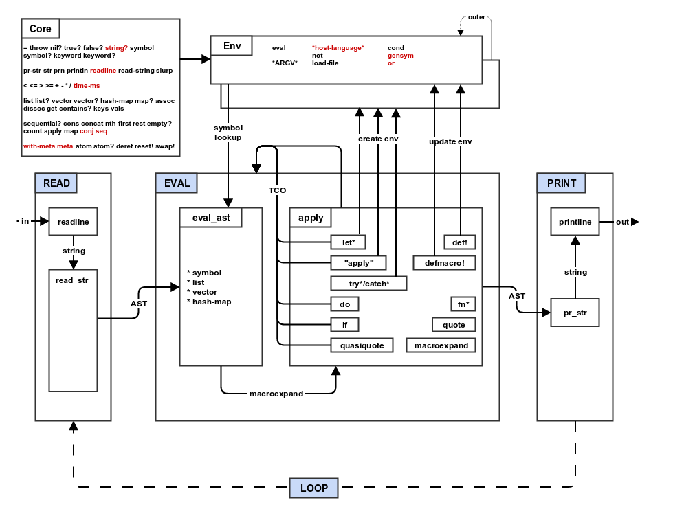

# MAL - Make a lisp
source: https://github.com/kanaka/mal

## Jisp
mal, made in java

### Progress:
* [x] step0_repl
* [x] step1_read_print
* [x] step2_eval
* [ ] step3_env
* [ ] step4_if_fn_do
* [ ] step5_tco
* [ ] step6_file
* [ ] step7_quote
* [ ] step8_macros
* [ ] step9_try
* [ ] stepA_mal